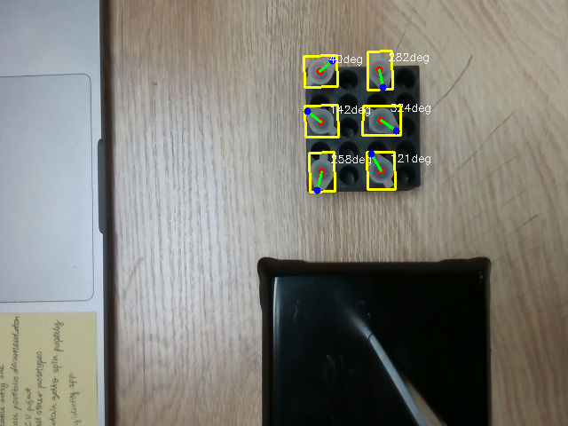
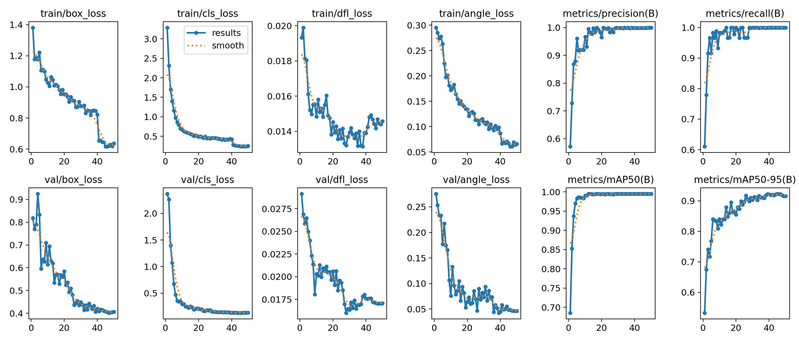
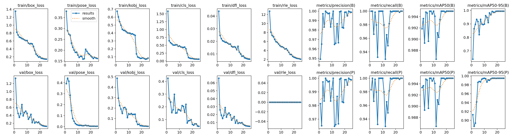

# Microcentrifuge Tube Detection & Orientation Estimation

A two-stage deep learning pipeline for detecting microcentrifuge tubes and estimating their full 360° orientation using **YOLO-OBB** (Oriented Bounding Box) for localization and **YOLO-Pose** for keypoint-based orientation refinement.

<p align="center">
  
</p>

---

## Table of Contents

- [Pipeline Overview](#pipeline-overview)
- [Dataset](#dataset)
- [Installation](#installation)
- [Usage](#usage)
- [Training Strategy](#training-strategy)
- [Design Choices & Anti-Overfitting Measures](#design-choices--anti-overfitting-measures)
- [Training Results](#training-results)
- [Final Evaluation Results](#final-evaluation-results)
- [Alternative Approaches Explored](#alternative-approaches-explored)
- [Repository Structure](#repository-structure)

---

## Pipeline Overview

The pipeline follows a **two-stage architecture** to solve both tube localization and orientation estimation:

```
                     Full Image (640×480)
                              │
                    ┌─────────▼──────────┐
                    │  Stage 1: YOLO-OBB │
                    │  (Tube Detection)  │
                    └─────────┬──────────┘
                              │
                     Oriented Bounding Boxes
                     (cx, cy, w, h, rotation)
                              │
                    ┌─────────▼──────────┐
                    │  Crop & Pad (15%)  │
                    │   Per-tube crops   │
                    └─────────┬──────────┘
                              │
                    ┌─────────▼──────────┐
                    │ Stage 2: YOLO-Pose │
                    │ (Keypoint Detect.) │
                    └─────────┬──────────┘
                              │
                     2 Keypoints per tube:
                     • Center (joint)
                     • Tab (flap direction)
                              │
                    ┌─────────▼──────────┐
                    │  Angle Computation │
                    │ atan(Tab - Center) │
                    └─────────┬──────────┘
                              │
                    angle_deg ∈ [0°, 360°)
```

### Why Two Stages?

OBB detectors provide a rotation angle, but it has a **180° ambiguity** - the model cannot distinguish which end of the tube has the cap flap. By introducing a second stage that predicts two semantically meaningful keypoints (Center and Tab), we resolve this ambiguity and achieve full 0-360° orientation estimation with a mean error of just **3.01°**.

---

## Dataset

- **70 images** (640×480 RGB) of microcentrifuge tubes in various orientations
- **372 tube annotations** with:
  - Center coordinates, bounding box (x, y, w, h, rotation), angle in degrees
  - 3-6 tubes per image across varied backgrounds
- **Stratified split**: 80% train (55 images) / 20% test (15 images) using K-Means clustering on average background color to ensure background diversity in both splits

---

## Installation

```bash
git clone https://github.com/wejhdy/zeon-systems.git
cd zeon-systems
pip install -r requirements.txt
```

**Requirements**: Python 3.10+, CUDA-capable GPU recommended.

---

## Usage

### Full Pipeline (from raw data to evaluation)

```bash
# 1. Exploratory Data Analysis
python eda.py

# 2. Split into train/test
python split_dataset.py

# 3. Prepare YOLO-OBB labels
python prepare_obb.py

# 4. Train YOLO-OBB with 5-Fold Cross-Validation
python train_cv.py

# 5. Prepare YOLO-Pose crop labels
python prepare_pose.py

# 6. Train YOLO-Pose with 5-Fold Cross-Validation
python train_pose_cv.py

# 7. Evaluate OBB model on holdout test set
python validate_obb.py

# 8. Full pipeline evaluation (OBB + Pose)
python validate_pipeline.py
```

### Inference on a single image

```bash
python infer.py path/to/image.png
```

This outputs:
- Annotated image with OBB boxes, center dots, and orientation arrows
- `predictions.csv` with per-tube results

---

## Training Strategy

### 5-Fold Cross-Validation

With only **55 training images**, a single train/val split would be unreliable. We use 5-Fold CV to:
- Maximize training data utilization (each fold trains on ~45 images)
- Get a robust estimate of generalization performance
- Select the best-performing fold's weights for the final model

### Data Augmentation

Augmentation is critical for this small dataset. We apply **Albumentations pipelines** before training:

**OBB Augmentation** (`augment_obb.py` - 20× per image):
- Pixel-level: brightness/contrast, hue/saturation, CLAHE, blur, noise, compression
- Spatial: horizontal/vertical flip, affine (scale 0.8-1.4, rotate ±180°, shear ±10°)
- Occlusion: CoarseDropout (random rectangular masks)
- Annotations are encoded as **6 keypoints per tube** (center, angle direction, 4 OBB corners) and transformed jointly with the image, then decoded back

**Pose Augmentation** (`augment_pose.py` - 5× per crop):
- Similar pixel-level transforms
- Conservative spatial transforms (crops are small, ~50-100px)
- No CoarseDropout (would mask the entire tube in small crops)

---

## Design Choices & Anti-Overfitting Measures

With a small dataset of only 70 images, overfitting is the primary risk. Every design decision was made with this constraint in mind:

### 1. Nano Model Architecture (`yolo26n`)

We use the **nano** variant of YOLO (smallest available) to minimize parameter count. Fewer parameters = harder to memorize the training set.

### 2. Layer Freezing (`freeze=10`)

The first 10 layers of the backbone are **frozen** during training. These layers contain general-purpose low-level feature detectors (edges, textures, colors) that were learned from COCO pre-training. By freezing them:
- We prevent catastrophic forgetting of useful general features
- We reduce the number of trainable parameters by ~60%
- Only the higher-level detection head adapts to our specific tube detection task

### 3. High Dropout (`dropout=0.3`)

A dropout rate of 30% is applied to regularize the model. This randomly deactivates neurons during training, forcing the network to learn redundant representations rather than memorizing specific training samples.

### 4. Weight Decay (`weight_decay=0.001`)

L2 regularization on weights penalizes large weight magnitudes, further discouraging overfitting and encouraging simpler learned representations.

### 5. Cosine Learning Rate Schedule (`cos_lr=True`)

The learning rate follows a cosine annealing schedule from `lr0=0.001` down to `lrf * lr0`. This allows aggressive early learning and gentle fine-tuning later, reducing the risk of overfitting in later epochs.

### 6. Early Stopping (`patience=20`)

Training stops automatically if validation metrics don't improve for 20 consecutive epochs, preventing the model from training past the point of diminishing returns.

### 7. Mosaic & MixUp Augmentation

- **Mosaic** (`mosaic=1.0`): Combines 4 training images into one, exposing the model to more context variation per batch
- **MixUp** (`mixup=0.15`): Blends pairs of images and labels, creating soft training targets that act as a regularizer

### 8. Aggressive Offline Augmentation

Before YOLO's built-in augmentation, we apply our own offline augmentation (20× for OBB, 5× for Pose) using Albumentations with full geometric transforms. This effectively increases the dataset from 56 to 1000+ unique training images.

---

## Training Results

### Stage 1: YOLO-OBB (Tube Detection)

Training curves from the best fold (Fold 1), 50 epochs:

<p align="center">
  
</p>

Key observations:
- **mAP50 reaches 0.995** by epoch ~12 and remains stable - the model detects nearly all tubes
- **Train loss steadily decreases** without divergence from validation loss - no severe overfitting
- The sharp loss drop at epoch 41 corresponds to the `close_mosaic=10` setting which disables mosaic augmentation for the final 10 epochs, allowing the model to fine-tune on cleaner single images

### Stage 2: YOLO-Pose (Keypoint Orientation)

Training curves from the best fold (Fold 1), 25 epochs:

<p align="center">
  
</p>

Key observations:
- Both **box mAP50 and pose mAP50 reach 0.995** - the model accurately localizes both keypoints
- The pose loss converges by epoch ~15, validating that 25 epochs is sufficient for this task
- Training on 256×256 crops (vs 640 for OBB) is computationally efficient and appropriate since each crop contains a single tube

---

## Final Evaluation Results

Evaluated on the **holdout test set** (14 images, never seen during training or cross-validation):

### Detection Metrics

| Metric | Value |
|--------|-------|
| True Positives | 80 |
| False Positives | 2 |
| False Negatives | 1 |
| **Precision** | **0.976** |
| **Recall** | **0.988** |
| **F1-Score** | **0.982** |

### Orientation Accuracy

| Metric | Value |
|--------|-------|
| **Mean Absolute Angle Error** | **3.01°** |
| Median Angle Error | 2.30° |


> **All 80 matched tubes** have an orientation error under 15°, with a mean error of just 3.01°. This validates the two-stage approach for resolving the 180° OBB ambiguity.

---

## Alternative Approaches Explored

### 1. Classical ML for Orientation (Replacing Pose Stage)

Before the YOLO-Pose approach, I explored a **Classical Computer Vision + Machine Learning** pipeline for resolving tube orientation:

- **Feature extraction**: HOG (Histogram of Oriented Gradients) descriptors from OBB-cropped tube images
- **Classifier**: XGBoost trained to predict the 0° vs 180° flip direction
- **Results**: While this worked for some clear cases, it struggled with:
  - Tubes at oblique angles where the cap flap is not visually distinct
  - Sensitivity to crop alignment - small shifts in OBB crop boundaries changed HOG features significantly
  - Generalizing across different background colors

The keypoint-based YOLO-Pose approach proved far more robust because it learns to directly localize semantic landmarks (center joint and cap flap) rather than relying on hand-crafted gradient features.

### 2. Unified Mask R-CNN with Modified RPN (Future Direction)

A potentially superior single-stage approach would be to modify **Mask R-CNN's Region Proposal Network (RPN)** to jointly output both oriented bounding boxes and keypoints from a single backbone:

- **Concept**: Extend the RPN head to predict OBB parameters (cx, cy, w, h, θ) alongside keypoint heatmaps (Center + Tab) in a single forward pass, eliminating the two-stage crop-and-re-infer overhead
- **Advantages over the current two-stage pipeline**:
  - **Single inference pass** - no need to crop and re-run a second model per detection, significantly faster at scale
  - **Shared feature extraction** - the backbone computes features once, and both OBB regression and keypoint localization share the same high-quality feature maps
  - **Architectural elegance** - a single unified model is easier to deploy, version, and maintain
- **Why it was not implemented**:
  - Time constraints of the assignment prevented exploration of this architecture, though it remains the most promising direction for a production system

### 3. EfficientDet

I evaluated **EfficientDet** as an alternative to YOLO for the detection stage:

- **Approach**: EfficientDet-D0 (smallest variant) for axis-aligned bounding box detection
- **Why YOLO-OBB was chosen instead**:
  - YOLO-OBB produces oriented bounding boxes natively, while EfficientDet only outputs axis-aligned boxes - would still need post-processing for rotation
  - YOLO's ecosystem (Ultralytics) provides built-in OBB, Pose, augmentation, and metrics in a single unified framework
  - YOLO26n is purpose-built for real-time inference with minimal parameters, ideal for a small dataset
  - The training pipeline (cross-validation, augmentation, evaluation) integrates seamlessly with Ultralytics

---

## Repository Structure

```
zeon-systems/
├── README.md                   # This file
├── requirements.txt            # Python dependencies
├── annotations.csv             # Master annotations (372 tubes, 70 images)
│
├── images/                     # Raw dataset images (70 PNGs)
│
├── weights/                    # Trained model weights
│   ├── obb_best.pt             # Best YOLO-OBB model
│   └── pose_best.pt            # Best YOLO-Pose model
│
├── docs/                       # Training graphs & documentation assets
│   ├── obb_training_curves.png
│   ├── pose_training_curves.png
│   ├── obb_confusion_matrix.png
│   ├── pose_confusion_matrix.png
│   ├── obb_pr_curve.png
│   ├── pose_pr_curve.png
│   └── sample_prediction.png
│
├── eda_outputs/                # EDA visualizations
│   ├── tubes_per_image.png
│   ├── bbox_size_distribution.png
│   ├── angle_polar_distribution.png
│   └── background_color_clusters.png
│
├── eda.py                      # Exploratory Data Analysis
├── split_dataset.py            # Stratified train/test split
├── prepare_obb.py              # Generate YOLO-OBB label files
├── prepare_pose.py             # Generate tube crops + YOLO-Pose labels
├── augment_obb.py              # Augmentation pipeline for OBB data
├── augment_pose.py             # Augmentation pipeline for Pose crops
├── train_cv.py                 # 5-Fold CV training for YOLO-OBB
├── train_pose_cv.py            # 5-Fold CV training for YOLO-Pose
├── infer.py                    # Two-stage inference pipeline
├── validate_obb.py             # OBB model evaluation on test set
└── validate_pipeline.py        # Full pipeline evaluation (OBB + Pose)
```
